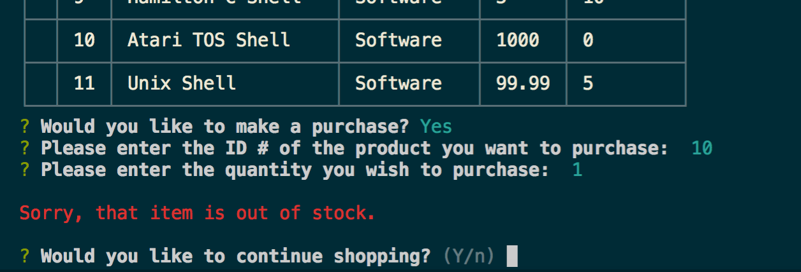

# shell-store
A fictional store full of CRUD with a CLI. MySQL and Node.js

## Description
This is a command line application based on the idea of a store. This is a fictional store, the app is just for fun. 

## How to Use
**Note: To run this application you will need to have *npm* installed ([How to install NPM](https://docs.npmjs.com/downloading-and-installing-node-js-and-npm)). Additionally, to avoid complications, it is reccommended that you are using *bash* as your shell. [Install Bash for Windows](https://www.windowscentral.com/how-install-bash-shell-command-line-windows-10).**

To run the application on your machine, clone this repository ([How to clone a repo](https://help.github.com/articles/cloning-a-repository/)). Once you have cloned the repository, navigate to the newly cloned "shell-store" directory and run ```npm install``` to install the dependencies defined in this project's *package.json* file. 

There are two files you can run:
1. customer.js
2. manager.js

## customer.js 
Run ```$ node customer.js```

You take on the role of a potential patron of the shell store (see, its an RPG too, who knew?!). 
### Features of customer.js
1. Displays all products at start
2. Choose a product to buy (selecty by ID #), and choose qty to purchase.
3. The qty you purchase will be removed from the stock qty field, and your purchase total will be displayed.
4. If the stock qty is at 0, you will get a message saying the item is out of stock.




## manager.js
Run ```$ node manager.js```

You take on the role of manager at the shell store. 
### Features of manager.js
1. View Products - lists all products
2. View Low Inventory - products with less than 5 stock qty will be displayed.
3. Replenish Inventory - re-stock the inventory of an item
4. Add New Product - add a new product to the database


